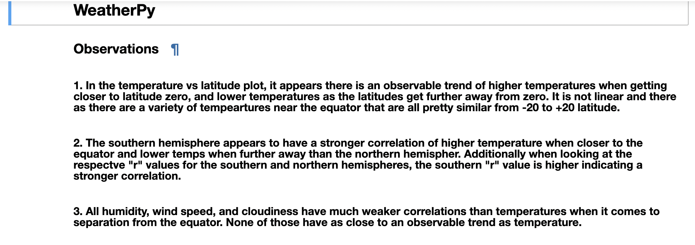
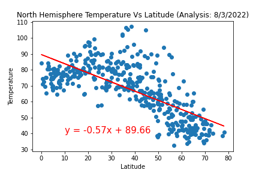

Summary/Problem: This repo contains an analysis of weather data obtained by retrieving data from an API. Is there a correlation between latitude and characteristics like temperature and humidity? The analysis of the data is also used to help find potential optimal vacation locations. Based on certain weather characteristics determined by the user, we are outputting data that meets the criteria. See observations from data exploration below.

1. The `WeatherPy` file has the analysis of over 500 cities looking at observable trends related to temperature, humidity, cloudiness, and wind speed in relation to the city's latitude.

    + Note that there is an `output_images` folder that contains all of the image outputs for this exercise. The images are titled based on the matplotlib plot they are displaying.
    + The `cities_submit.csv` is the output file of all the random cities generated and will be used in the `VacationPy` exercise.
    + The three observable trends can be found at the beginning of the jupyter notebook.
    + The notebook also has brief explanations after the matplotlib plots.

***

2. The `VacationPy` looks at the random cities generated from the previous exercise and selects some ideal weather locations to get a more refinded search for a preferred location for a vacation.
    + Note that there is a screenshot in the `output_images` folder that shows the screenshot of the heatmap with the clickable markers on it as well.
